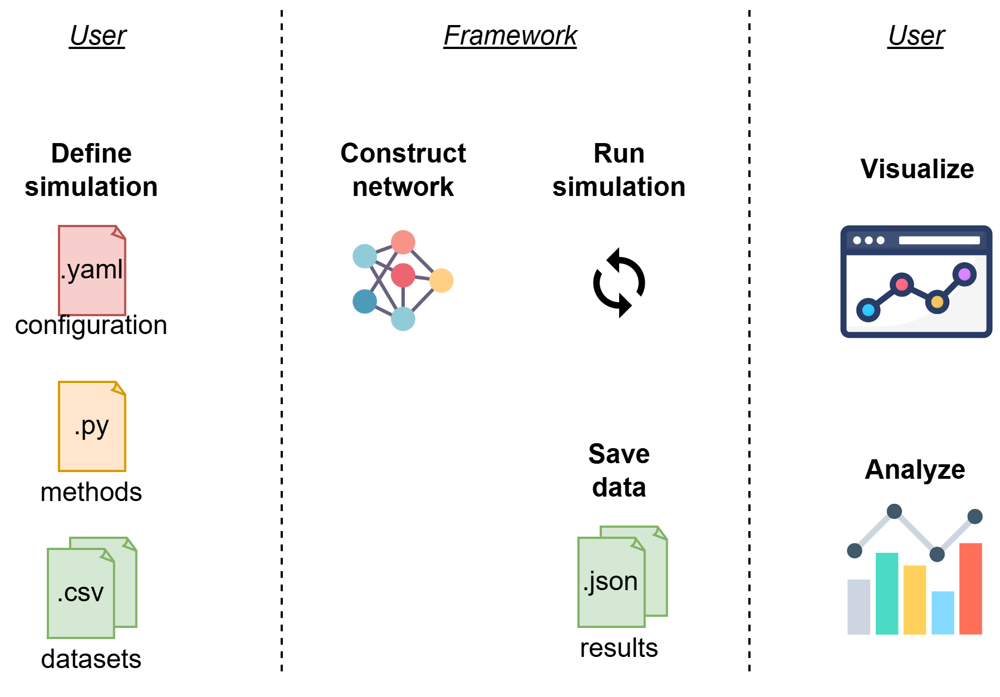

.. crowd documentation master file, created by
   sphinx-quickstart on Thu Dec 19 14:46:14 2024.
   You can adapt this file completely to your liking, but it should at least
   contain the root `toctree` directive.

Crowd: A Social Network Simulation Framework
============================================
.. Add your content using ``reStructuredText`` syntax. See the
.. `reStructuredText <https://www.sphinx-doc.org/en/master/usage/restructuredtext/index.html>`_
.. documentation for details.

**Crowd** is a social network simulation framework which simplifies and fastens the process of developing agent-based models and simulations on networks. 

**Highlighted Features:**

- Configuration files to set up simulations
- No-code diffusion simulations
- Interactive network visualization and chart generation with the graphical user interface
- Customized models with user-methods and class extensions
- Allowing the use of any Python library
- Running multiple simulations (with the same or different settings) and aggregating results

**How Crowd operates:**

|
**Navigate to:**

- :doc:`Getting Started <getting_started/index>`
- :doc:`Introduction to Crowd <introduction/index>`
- :doc:`Examples <examples_docs/index>`
- :doc:`Contact <contact/index>`

Citation
--------
Please cite the following paper if you use Crowd: 

Rende, A. N. N., Yilmaz, T., & Ulusoy, Ö., "Crowd: A Social Network Simulation Framework," arXiv preprint arXiv:2412.10781, 2024.

.. toctree::
   :hidden:
   :maxdepth: 2

   getting_started/index
   introduction/index
   examples_docs/index
   contact/index