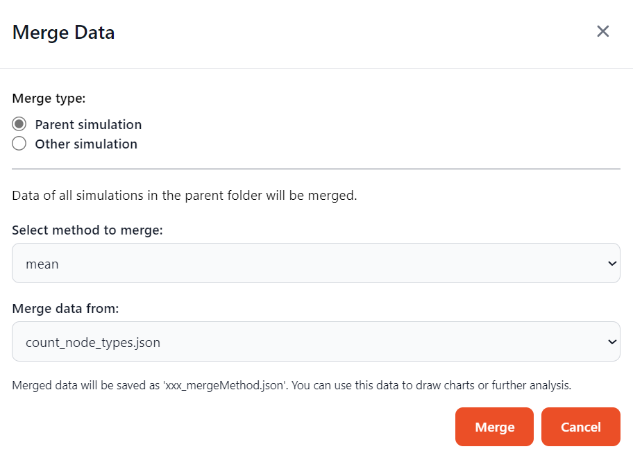
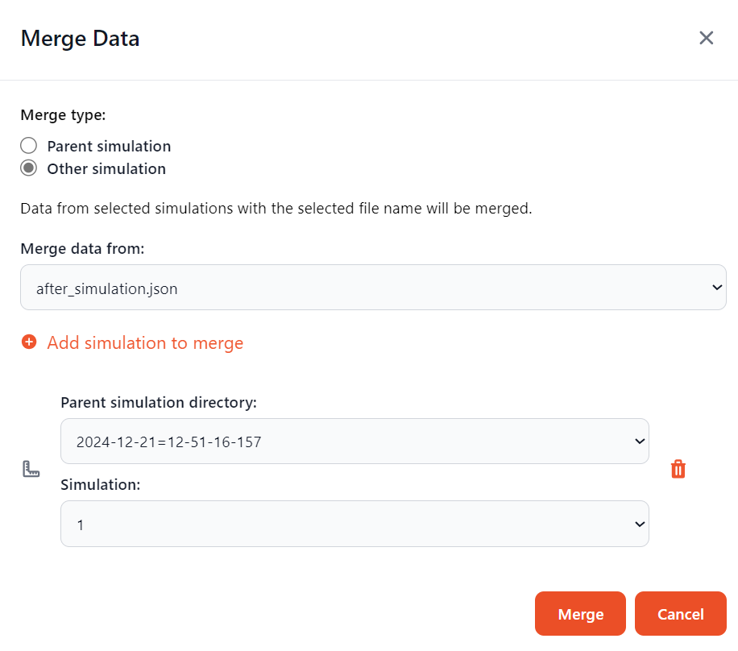

Step 6: Data Merge
==================

Data merge functionality of Crowd allows aggregating simulation results with certain operations.

Currently supported operations for aggregation:
    1. Mean (average)
    2. Sum

Available merge methods:
    1. Merge within parent directory
    2. Merge with other simulation

The first option allows aggregating the results of the batches
by a user-selected method, such as getting the mean or sum of
the results of the user-implemented data collection methods.

In the second option, data across different simulations can be
merged, with the restriction of having the same file name and
content format. The merge operations are conducted after the
simulations conclude, either through the library or the app.

**Library**

**Reminder:** As we don't run multiple simulations in our *simplediffusion* example, the following examples only demonstrate the merge operations for other projects.

**Step 1: Import merge methods from Crowd API**

The merge methods are originally implemented in the Project class and can be directly called from a project object by providing the necessary parameters. 
In this example, instead of creating a new Project object and arranging the simulation directory, we utilize Crowd API's methods for simplicity.

.. code-block:: python 

    from crowd.api.merge_methods import MergeMethods

    mrg = MergeMethods()

**Step 2: Execute the merge method of choice**

*1. Merge in parent simulation*: In this example, we will take the average of all count_node_types in the parent folder
and write the results to current simulation's folder (named as count_node_types_mean.json). The results can be used to draw charts in the results page of Crowd.

.. code-block:: python 

    """
        Parameters: 
            - project_name: "firstcustom"
            - parent_simulation_dir: "2024-08-22=10-35"
            - simulation_dir: "1"
            - json_file_name: "count_node_types.json"
            - merge_method: "mean"
    """
    mrg.merge_in_parent_sim("firstcustom", 
                            "2024-08-22=10-35", 
                            "1", 
                            "count_node_types.json", 
                            "mean")

*2. Merge with other simulation*: In this example, we merge the data from *after_simulation_mean.json* file of 3 simulations. 
The results will be saved in a file named: *after_simulation_mean_merged_{date}.json*.

.. code-block:: python 

    """
        Parameters: 
            - project_name: "firstcustom"
            - parent_simulation_dir: "2024-08-22=10-35"
            - simulation_dir: "1"
            - json_file_name: "after_simulation_mean.json"
            - merge_dir_list: [...]
    """
    mrg.merge_with_other_sim("firstcustom", 
                             "2024-08-22=10-35", 
                             "1", 
                             "after_simulation_mean.json", 
                             [
                                "2024-08-22=11-05/1",
                                "2024-08-22=11-33/1"
                             ])

In the following block, we provide the resulting JSON: Contents of "after_simulation_mean" from each simulation is placed on the same file. 

.. code-block:: json

    [
        {
            "r_UT": 0.0,
            "T": 546.0,
            "I": 478.0,
            "U": 0.0,
            "Wealth": 3629.577
        },
        {
            "r_UT": 0.1,
            "T": 537.0,
            "I": 487.0,
            "U": 0.0,
            "Wealth": 3712.755
        },
        {
            "r_UT": 0.2,
            "T": 570.0,
            "I": 454.0,
            "U": 0.0,
            "Wealth": 3587.373
        }
    ]

This data can later be used to draw the following charts:

.. image:: merge_images/players_vs_r_UT.png
    :alt: Example chart from merge 1
    :width: 400px
    :align: center
    
.. image:: merge_images/wealth_vs_r_UT.png
    :alt: Example chart from merge 2
    :width: 400px
    :align: center

**App**

Merge operations are conducted in the Results tab of the GUI. By selecting the "Merge data" option, we can open the merge menu. 

.. image:: SIR_example_images/resultsNew.png
    :alt: Results screen of Crowd's GUI
    :width: 400px
    :align: center

The first option, merge within parent simulation, requires selecting the merge method (mean or sum), and the file that holds the data. 

The second option, merge with other simulation, requires selecting:
    1. Data file
    2. Parent simulation directory
    3. Sub simulation number

All simulations to be merged must be added together in this fashion. The currently viewed simulation is added by default and the results will be saved in the current simulation.
The results will be saved in a file named: *after_simulation_merged_{date}.json*.

Following these operations, the new data can be used to draw charts in the same page.

**Next:** Step 7: Generate charts 