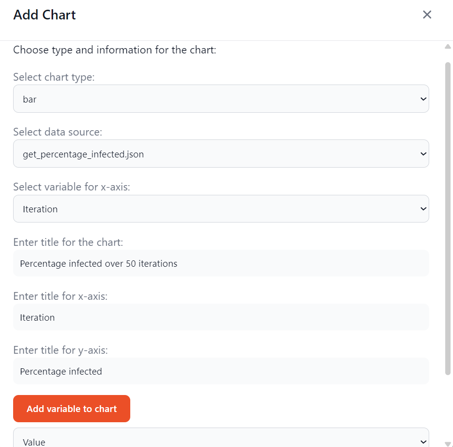
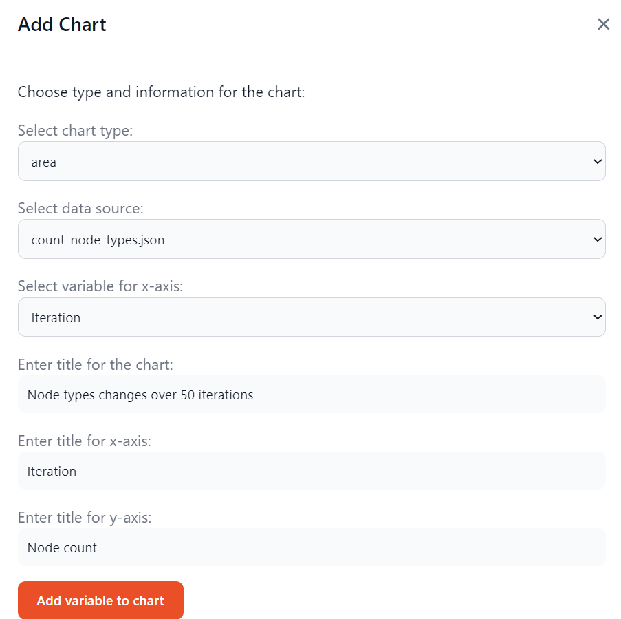
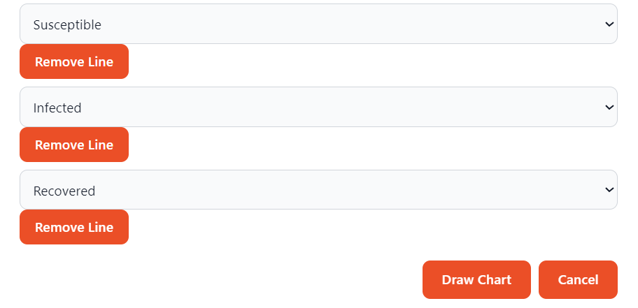

Step 7: Generate Charts
=======================

In the graphical user interface of Crowd, charts can be drawn using simple selectors. 

.. image:: SIR_example_images/resultsNew.png
    :alt: Results screen of Crowd's GUI
    :width: 700px
    :align: center

Crowd currently supports the following chart types, based on the JavaScript library ApexCharts:
    1. line
    2. bar
    3. area
    4. scatter
    5. heat map
    6. range bar

Each graph type may require different type of data. If the resulting chart is not as expected, it is advised to visit
`ApexCharts website <https://apexcharts.com/>`_ to check the requirements and examples. 

In this example, we will be drawing a bar chart using the data saved with our custom method get_percentage_infected.
Various data series can be given for a single chart. To achieve that, add variable to chart option can be used. 

.. code-block:: json

    {
        "Iteration": 1, 
        "Value": 14
    }

In the block above, contents of get_percentage_infected.json for the first iteration is given. From this file, we select the "Iteration" variable's values to be displayed on the x-axis,
and "Value" variable to be on y-axis. 

As mentioned in the previous sections, Crowd's CustomSimulationNetwork and DiffusionNetwork collect the number of each node type every iteration and save it to a file.
This can also be used to draw charts. In the following part, we will draw an area chart using this data.

.. code-block:: json

    {
        "Iteration": 5, 
        "Susceptible": 73, 
        "Infected": 17, 
        "Recovered": 10
    }

In the block above, contents of count_node_types.json for the fifth iteration is given. From this file, we select the "Iteration" variable's values to be displayed on the x-axis,
and "Susceptible", "Infected" and "Recovered" variables to be on y-axis. By passing in 3 variables, we are able to create 3 lines.

The resulting graphs are given in the first image of this page. The graphs are interactive, showing the detailed information on hover; while line, area and scatter charts can also be zoomed in/out and moved. 
It is possible to download the graphs in PNG and SVG formats, or its data in a CSV file. 

**Next:** More examples