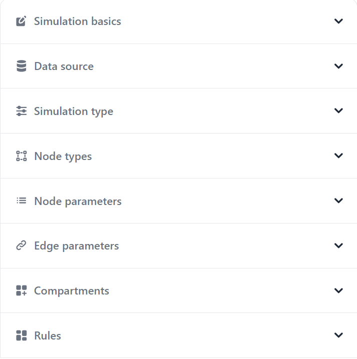
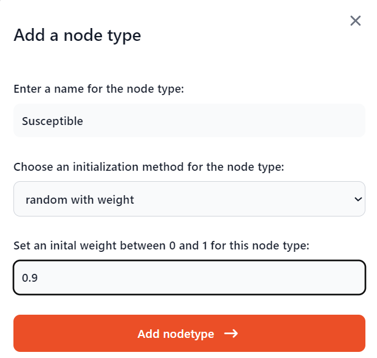

Step 2: Modify Configuration
============================
   
Crowd employs a configuration file approach to define the simulation settings. This can be done by either modifying the YAML file directly, or using the buttons and selectors in the GUI.

**Library/App's Settings Page**

We will first go over how to construct the YAML file. After the creation of a project, conf.yaml file is added automatically on the Project folder. In the Settings page of the app, we can directly modify this file and save its contents. 

Alternatively, conf.yaml file itself can be modified, or contents of another file can be copied while using the library. We have sir.yaml file located in the same directory with the main file, which we will copy its contents, using the following code:   

.. code-block:: python
    
    import os

    conf_path = os.path.join(os.path.dirname(__file__), 'sir.yaml')
    my_project.update_conf_with_path(conf_path)

Now, we inspect the contents of the configuration file:

.. code-block:: yaml

    name: SIR-example
    structure:
        random:
            count: 100
            degree: 4
            type: random-regular
    definitions:
        pd-model:
            name: diffusion
            nodetypes:
                Susceptible:
                    random-with-weight:
                        initial-weight: 0.9
                Infected:
                    random-with-weight:
                        initial-weight: 0.1
                Recovered:
                    random-with-weight:
                        initial-weight: 0
            node-parameters:
                numerical:
                    age:
                    - 0
                    - 100
            compartments:
                c1:
                    ratio: 0.1
                    triggering_status: Infected
                    type: node-stochastic
                c2:
                    iteration-count: 4
                    name: healing
                    type: count-down
            rules:
                r1:
                    - Susceptible
                    - Infected
                    - c1
                r2:
                    - Infected
                    - Recovered
                    - c2

Explanation of each property:

 - **name**: This name can later be used in GUI to search for this simulation, so it is useful to pick a meaningful name.

 - **structure**: Describes how the network will be initialized. Crowd supports reading networks from csv and edgelist files, while providing various network generators from NetworkX and igraph-python libraries. In this example, we choose to generate a random regular network (type), with 100 nodes (count) and each node having a constant degree of 4 (degree).

 - **definitions**: Holds properties for the network initialization and (optionally) the simulation logic (compartments and rules).

 - **pd-model**: Means we want to use a predefined model in our simulation. We do not include this keyword for custom simulations.

 - **name: diffusion**: Specifying that we want to use DiffusionNetwork model of Crowd.

 - **nodetypes**: Defining each node type for our model and their initialization methods. For this example, we choose (0.9 * node_count) nodes as Susceptible initially.

 - **node-parameters**: Can be numerical or categorical. We define each parameter by giving a name. For numerical parameters, Crowd assigns each node a value between [lower-bound, upper-bound] provided. For categorical parameters, a list of possible categories should be given. Alternatively, users can specify a file path to read the values from.

 - **compartments**: Rule-bits that we use to specify the conditions of a node state change. This feature is based on Network Diffusion Library (NDLib) and is integrated into only DiffusionNetwork model. More information about each compartment type can be found on the given link.

 - **rules**: Consists of: (a) current state of the node, (b) state to move, (c) compartment to use.

Explanation of this simulation's rules:

 - **r1**: If a node is susceptible, execute c1. If this node has any Infected neighbors (triggering status), with a probability of 0.1 (ratio), the node switches from Susceptible to Infected state.

 - **r2**: describes the Infected to Recovered sequence, which is described with a countdown compartment. This means that after 4 iterations, the node will switch states.

**App's Project Page**

   Simulation settings in the Project page

.. figure:: ../SIR_example_images/data-source.png
   :alt: Data source in the Project page of Crowd GUI
   :width: 50%
   :align: center

   Data source selection in the Project page

   Adding node types in the Project page

.. figure:: ../SIR_example_images/nodetype-list.png
   :alt: List of node types in the Project page of Crowd GUI
   :width: 50%
   :align: center

   List of added node types in the Project page

In the next two pages, we list all the network generators integrated into Crowd for available use in the configuration file and the network models provided by Crowd. 
While they are not needed to understand this example, they serve as a reference for model development.

**Next:** (Optional) Network generators

.. toctree::
    :hidden:
    :maxdepth: 1
        
    network_generators
    crowd_models